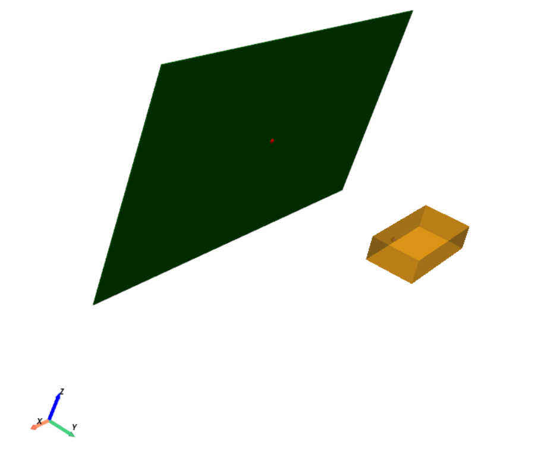
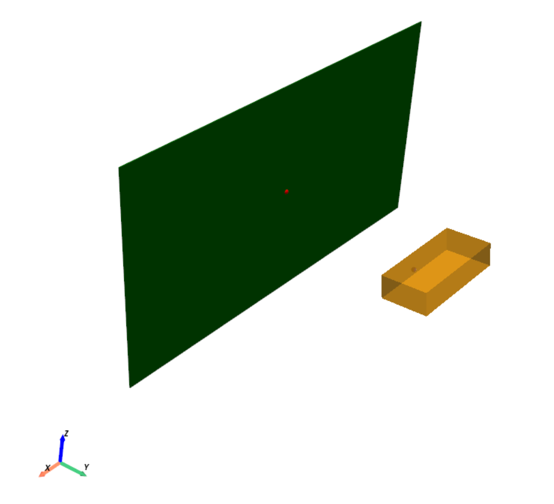

# 3D Pose Estimation and Visualization

This project estimates the 3D pose (translation and rotation) of a brick using depth images and visualizes the results. The server is built using FastAPI, and the visualizations are rendered with Open3D and PyVista.

## Table of Contents
- [Setup](#setup)
- [Usage](#usage)
- [Approach: Estimating 3D Pose Using Known Dimensions](#approach-estimating-3d-pose-using-known-dimensions)
- [Algorithm](#algorithm)
- [Visualization of Results](#visualization-of-results-on-sample-dataset)
- [Dependencies](#dependencies)

## Setup

### 1. Clone the Repository

First, clone this repository to your local machine:

```bash
git clone https://github.com/fclio/Machine-Vision-take-home.git
cd Machine-Vision-take-home
```

### 2. Conda Environment if needed

Create a new conda environment with the necessary dependencies:

```bash
conda create --name pose-estimation python=3.8
conda activate pose-estimation
```

### 3. Install Dependencies

Once your environment is set up, install the required dependencies from the `requirements.txt` file:

```bash
pip install -r requirements.txt
```

## Usage

### Running the Server

To run the server and expose the pose estimation functionality via FastAPI, use the following command:

```bash
python server.py
```

- This will start a FastAPI server at `http://127.0.0.1:8000`.
- The server accepts image uploads and returns the estimated 3D pose (translation and rotation) of the brick.

### Running the Main Script (`main.py`)

To run the `main.py` script that processes all the images and estimates the 3D pose of the brick:

```bash
python main.py
```

This script processes a set of depth images, estimates the 3D pose for each image, and visualizes the results in 3D.

### (Optional) For step by step visualization

To run the test script, which focuses on visualization:

```bash
python test.py
```

This script will generate 3D visualizations and display the point cloud at each stage of the algorithm for every image.

## Approach: Estimating 3D Pose Using Known Dimensions

1. **Initial Setup**:
   - The brick is assumed to be initially aligned with the **X-axis** as the longest side (210 mm), **Y-axis** as the short side (100 mm), and **Z-axis** as the thickness (50 mm).
   - The **geometry** of the brick is known, so I leverage Principal Component Analysis (PCA) to estimate the **rotation** by comparing the 3D point cloud to this reference configuration.

---

## Algorithm

1. **Extract the Point Cloud from Depth Image**  
   - The region corresponding to the front of the brick is cropped from the depth map.  
   - Converted to the task's coordinate system where **X = left/right**, **Y = from camera to wall**, and **Z = up/down**.  
   

2. **Crop the Point Cloud**  
   - Since the brick is placed near the center, I filter out far or noisy points to enhance accuracy.  
   

3. **Calculate the Centroid**  
   - Compute the centroid of the cropped cloud, which gives us the **translation** of the brick in the camera coordinate system.

4. **Extract Rotation (Roll, Pitch, Yaw)**  
   - The point cloud is centered around the origin by subtracting the centroid.  
   - PCA is applied to the centered cloud, revealing the principal axes corresponding to the brick’s orientation.  
   

5. **Compute Final Rotation**  
   - The rotation matrix from PCA axes is converted into **Euler angles** (Roll, Pitch, Yaw) to represent the 3D rotation.   
   

   — The **orange box** represents the estimated brick pose.  
   — The **grey points** are the filtered point cloud.

---

One of the primary trade-offs in our algorithm lies in the cropping strategy used to isolate the brick from the depth image. Relying on the assumption that the brick is generally placed near the center, and therefore apply a fixed-size crop to remove background noise. However, this introduces a delicate balance: if the crop is too small, it risks excluding parts of the brick or missing it entirely when it's off-center. On the other hand, a crop that is too large includes more of the surrounding scene, increasing the presence of irrelevant or noisy depth points, which can degrade the accuracy of the PCA-based rotation estimation. This trade-off reflects a compromise between flexibility and precision in detection.

---

## Visualization of Results on Sample Dataset  

> The green plane in the visualizations represents the **camera plane**.  
> The brick is orange.

### Image 0  
<table>
  <tr>
    <td></td>
    <td></td>
  </tr>
</table>

**Pose Estimation Result**  
- **Translation (x, y, z):** `[-9.72, 290.10, -53.37]` mm  
- **Rotation (Euler angles):**  
  - Roll (X): `4.49°`  
  - Pitch (Y): `0.40°`  
  - Yaw (Z): `0.71°`  

---

### Image 1  
<table>
  <tr>
    <td></td>
    <td></td>
  </tr>
</table>

**Pose Estimation Result**  
- **Translation (x, y, z):** `[-14.37, 313.05, -48.19]` mm  
- **Rotation (Euler angles):**  
  - Roll (X): `5.68°`  
  - Pitch (Y): `1.58°`  
  - Yaw (Z): `0.02°`  

---

### Image 2  
<table>
  <tr>
    <td></td>
    <td></td>
  </tr>
</table>

**Pose Estimation Result**  
- **Translation (x, y, z):** `[-10.35, 307.41, -47.83]` mm  
- **Rotation (Euler angles):**  
  - Roll (X): `7.20°`  
  - Pitch (Y): `1.58°`  
  - Yaw (Z): `-1.29°`  


---

### Image 3  
<table>
  <tr>
    <td></td>
    <td></td>
  </tr>
</table>

**Pose Estimation Result**  
- **Translation (x, y, z):** `[-19.15, 306.83, -43.65]` mm  
- **Rotation (Euler angles):**  
  - Roll (X): `8.08°`  
  - Pitch (Y): `0.55°`  
  - Yaw (Z): `-0.72°`  

---

###  Image 4  
<table>
  <tr>
    <td></td>
    <td></td>
  </tr>
</table>

**Pose Estimation Result**  
- **Translation (x, y, z):** `[-10.83, 314.03, -46.20]` mm  
- **Rotation (Euler angles):**  
  - Roll (X): `6.98°`  
  - Pitch (Y): `1.86°`  
  - Yaw (Z): `-1.71°`  

---

###  Image 5  
<table>
  <tr>
    <td></td>
    <td></td>
  </tr>
</table>

**Pose Estimation Result**  
- **Translation (x, y, z):** `[-10.15, 304.25, -48.21]` mm  
- **Rotation (Euler angles):**  
  - Roll (X): `6.75°`  
  - Pitch (Y): `1.55°`  
  - Yaw (Z): `-1.66°`  

---

###  Image 6  
<table>
  <tr>
    <td></td>
    <td></td>
  </tr>
</table>

**Pose Estimation Result**  
- **Translation (x, y, z):** `[-9.74, 309.52, -44.49]` mm  
- **Rotation (Euler angles):**  
  - Roll (X): `8.13°`  
  - Pitch (Y): `1.26°`  
  - Yaw (Z): `-1.41°`  

---

###  Image 7  
<table>
  <tr>
    <td></td>
    <td></td>
  </tr>
</table>

**Pose Estimation Result**  
- **Translation (x, y, z):** `[-11.11, 303.65, -43.15]` mm  
- **Rotation (Euler angles):**  
  - Roll (X): `8.92°`  
  - Pitch (Y): `1.61°`  
  - Yaw (Z): `-0.68°`  

---

###  Image 8  
<table>
  <tr>
    <td></td>
    <td></td>
  </tr>
</table>

**Pose Estimation Result**  
- **Translation (x, y, z):** `[-17.41, 293.64, -54.18]` mm  
- **Rotation (Euler angles):**  
  - Roll (X): `3.36°`  
  - Pitch (Y): `0.97°`  
  - Yaw (Z): `-0.72°`  

---

###  Image 9  
<table>
  <tr>
    <td></td>
    <td></td>
  </tr>
</table>

**Pose Estimation Result**  
- **Translation (x, y, z):** `[-12.34, 302.34, -47.85]` mm  
- **Rotation (Euler angles):**  
  - Roll (X): `6.98°`  
  - Pitch (Y): `2.00°`  
  - Yaw (Z): `-1.18°`  

---

###  Image 10  
<table>
  <tr>
    <td></td>
    <td></td>
  </tr>
</table>

**Pose Estimation Result**  
- **Translation (x, y, z):** `[-30.94, 325.81, -43.95]` mm  
- **Rotation (Euler angles):**  
  - Roll (X): `5.64°`  
  - Pitch (Y): `-1.06°`  
  - Yaw (Z): `13.52°`  

---
